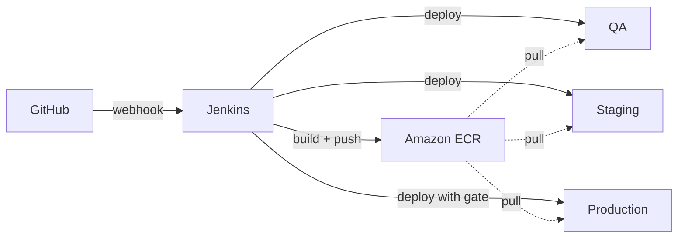
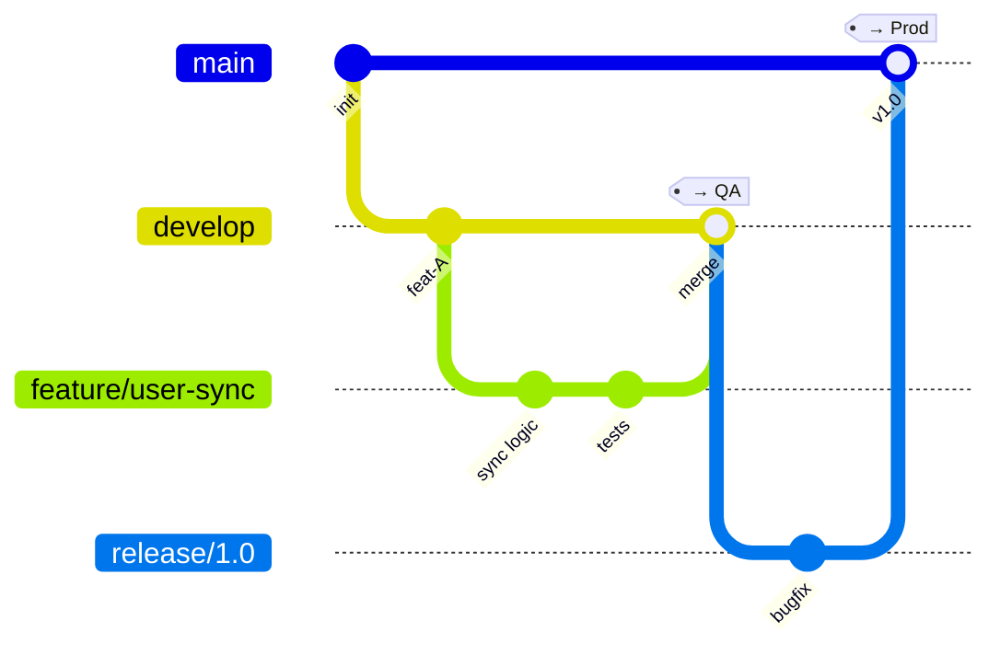

# CI/CD Pipeline Design

This covers how sync-service gets built, tested, and deployed through Jenkins across QA, Staging, and Production.

## How the pipeline works

At a high level: code lives in GitHub, Jenkins picks up changes via webhooks, builds a Docker image, pushes it to ECR, and deploys to ECS Fargate. Pretty standard stuff, but the details matter.

## Branching strategy

I'm using a modified GitFlow approach. Each branch type maps to a specific environment, so there's never any confusion about what's deployed where.

Here's the mapping:

| Branch | Environment | What happens |
|---|---|---|
| `feature/*` | nowhere | CI only — build and test, no deploy |
| `develop` | QA | auto-deploy on merge |
| `release/*` | Staging | auto-deploy on push |
| `main` | Production | deploy after manual approval |

### How we prevent accidental prod deploys

This was a key concern, so there are three separate safeguards:

1. Branch protection on `main` — you can't push directly, only merge from `release/*` via PR
2. The PR itself needs at least one approval and passing Staging smoke tests
3. Even after the PR merges, Jenkins has a manual `input` step that someone has to click before the prod deploy actually happens (with a 30-min timeout so it doesn't hang forever)

## Pipeline stages

The pipeline behaves differently depending on whether it's a PR or an actual merge.

### On a PR (validation only)

When someone opens a PR against `develop`, we run:
1. Checkout the code
2. Build with Gradle (`./gradlew build -x test`)
3. Run unit tests
4. Run integration tests (Testcontainers spins up a real MongoDB)
5. SonarQube analysis with quality gate
6. Docker build just to make sure the Dockerfile isn't broken

No images get pushed, nothing gets deployed. The point is just to catch problems early.

### On a merge (build + deploy)

When code actually lands on `develop`, `release/*`, or `main`:
1. Figure out which environment we're targeting based on the branch
2. Full build + all tests again
3. Build Docker image, tag it as `<branch>-<sha>` (like `develop-a1b2c3d`), push to ECR
4. If it's `main`, wait for manual approval
5. Update the ECS task definition with the new image and trigger a rolling deploy
6. Hit `/actuator/health` to make sure the service came up okay
7. Post to Slack with the result

Before deploying, we also save the currently-running image tag to a file (`previous-image-tag.txt`) and archive it as a Jenkins artifact. That way if something goes wrong, we know exactly which image to roll back to.

## Deployment strategy

I went with rolling updates. Here's why:

| Strategy | Downtime | Extra cost | My take |
|---|---|---|---|
| Recreate | yes | none | not acceptable for a production API |
| Blue/Green | no | 2x resources | too expensive when you're running 3 environments |
| Rolling | no | ~25-50% briefly | good balance of safety and cost |

The ECS service is configured with `minimumHealthyPercent: 50` and `maximumPercent: 200`, so during a deploy at least half the tasks stay up while new ones come online. There's also a 60-second health check grace period for new tasks to warm up.

For critical production releases down the road, I'd layer in canary deployments — route maybe 5-10% of traffic to the new version through weighted target groups on the ALB, watch error rates and latency for a few minutes, then shift the rest over. This gives you a much tighter feedback loop than a straight rolling update where you're committed once the first task flips. ECS doesn't support this natively, but it's doable with CodeDeploy or a simple ALB weight-shifting script.

## Rollback

The deployment isn't done just because new tasks came up. The pipeline validates health before calling it a success, and there are two rollback paths depending on what went wrong.

**Failure during deploy (tasks won't start):** ECS circuit breaker catches this automatically. If new tasks keep failing health checks, ECS halts the rollout and reverts to the previous task definition. No human needed, service recovers in minutes. The pipeline detects the failure and fires a Slack alert (PagerDuty too for prod).

**Failure after deploy (app bug, smoke test fails):** The separate `Rollback_Jenkinsfile` handles this. It takes an image tag and target environment as parameters, swaps the image in the task definition, triggers a new rolling deploy, waits for stability, and runs a smoke test. The main pipeline archives `previous-image-tag.txt` after every deploy, so you always know which image to go back to.

**Deployment verification flow:**
1. ECS rolling update starts, new tasks must pass ALB health checks within 60 seconds
2. Once stable, Jenkins hits `/actuator/health` as a smoke test
3. If smoke test fails, pipeline stops and alerts the team — no further environments get the bad image
4. All ECR images are retained for 30+ days, so any recent version can be restored

## Config and secrets

Nothing sensitive lives in the code or Docker images. Here's where things go:

- **Secrets** (MongoDB URI, API keys) → AWS Secrets Manager, referenced by ARN in the ECS task definition
- **App config** (Spring profile, feature flags) → SSM Parameter Store, namespaced by environment (`/cloudeagle/qa/config/*`, `/cloudeagle/prod/config/*`, etc.)
- **CI stuff** (ECR URL, SonarQube token) → Jenkins credential store

ECS resolves all the ARN references at container startup, so the actual values never show up in logs or task definition metadata.

## Trade-offs and what I deliberately left out

A few decisions here were conscious trade-offs, not oversights:

**Jenkins over GitHub Actions or GitLab CI.** The assignment specifies Jenkins, so that's what I used. But honestly, even if it didn't — Jenkins is already in place at CloudEagle, the team knows it, and migrating CI/CD tools mid-flight is rarely worth the disruption. GitHub Actions would be simpler for a greenfield project, but switching tools just to be trendy isn't good engineering.

**No canary deployments yet.** Rolling updates are good enough for a single service with moderate traffic. Canary adds complexity (weighted target groups, metric-based promotion logic, rollback automation) that isn't justified until you're deploying frequently to production and need tighter blast radius control. I described how to add it later because the ALB already supports weighted routing — it's not a rearchitecture, just an enhancement.

**No deployment to multiple environments in parallel.** The pipeline deploys to one environment per branch merge. I could have added a "promote" flow where a single image moves QA → Staging → Prod in sequence, but that adds pipeline complexity and the current branch-per-environment model is easier to reason about. If the team finds the branch workflow too slow, promotion-based deploys would be the next step.

**SonarQube quality gate can block PRs.** This is intentional — I'd rather have a developer fix a code smell before merge than accumulate tech debt. But it does mean the quality gate needs to be tuned carefully. If it's too strict, people start working around it. The 5-minute timeout on the gate check is there so a slow SonarQube server doesn't block the whole pipeline.

## Where this is headed: GitOps

The current setup works well — Jenkins pushes deploys imperatively, and it's simple to reason about. But as the team and service count grow, I'd move toward a GitOps model using something like ArgoCD or Flux.

The idea is that instead of Jenkins directly calling `aws ecs update-service`, it would update a manifest in a Git repo (the "desired state"), and a GitOps controller running in the cluster would reconcile the actual state to match. This gives you a few things you don't get with the current approach:

- Full audit trail of every deployment in Git history (who changed what, when, and why)
- Drift detection — if someone manually tweaks a task definition in the console, the controller catches it and reverts
- Easier rollback — just revert the Git commit
- Better separation of concerns — CI builds and tests, CD is handled by the GitOps controller

For now, the Jenkins-based approach is the right call. It's straightforward, the team already knows Jenkins, and there's only one service. But GitOps is the natural next step once we're running multiple services or need stricter change management.
