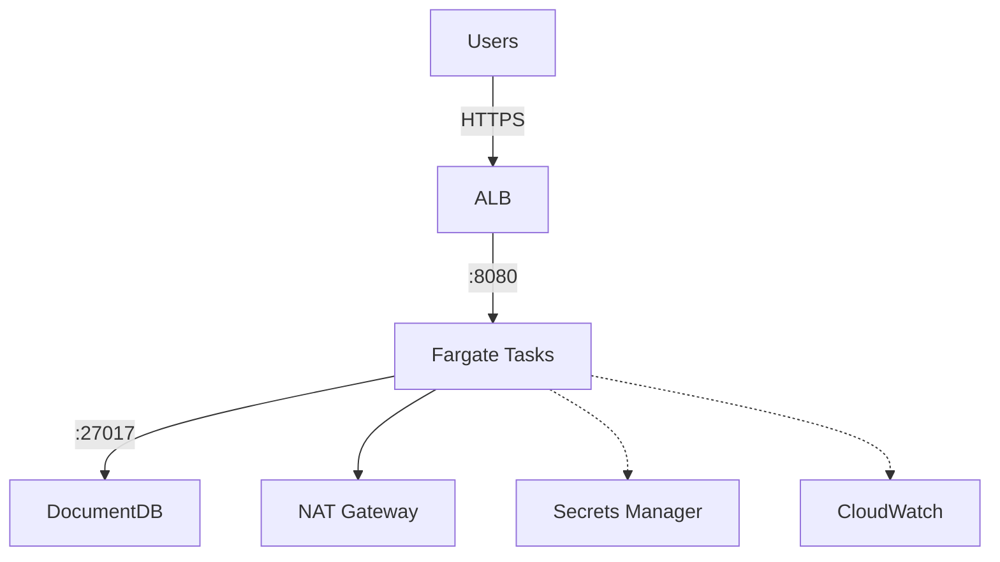

# AWS Infrastructure Design

This covers the compute, database, networking, security, and monitoring setup for running sync-service on AWS.

### Why AWS instead of GCP

The assignment originally specifies GCP, but I chose AWS because that's where my production experience is. I'd rather show a design I can actually defend in detail — with real service names, IAM patterns, and cost numbers I've worked with — than put together something theoretical on a platform I'm less familiar with. The architecture itself is cloud-agnostic in principle: ECS Fargate maps to GKE or Cloud Run, DocumentDB maps to MongoDB Atlas or Cloud Firestore, Secrets Manager maps to GCP Secret Manager, and CloudWatch maps to Cloud Monitoring. The patterns (private networking, least-privilege IAM, rolling deploys, centralized logging) are the same regardless of provider.

## Architecture overview

The basic flow: traffic comes in through an Application Load Balancer on HTTPS, gets routed to Fargate tasks running in private subnets, which talk to DocumentDB (also in private subnets). Outbound traffic goes through a NAT Gateway, and AWS service calls (ECR, Secrets Manager, etc.) go through VPC endpoints to avoid NAT charges.

Everything spans two availability zones for redundancy.

## Compute: ECS Fargate

I evaluated four options:

| Option | Cost/env | Why I didn't pick it |
|---|---|---|
| **ECS Fargate** | ~$30-80 | ← picked this one |
| ECS on EC2 | ~$20-60 + ops | have to manage instances, patching, AMIs |
| EKS | ~$150+ | $75/mo control plane, way too complex for one service |
| Plain EC2 | ~$15-40 + lots of ops | manual deploys, manual scaling, manual everything |

Fargate was the clear winner here. No servers to manage, pay-per-use pricing, and ECS handles rolling deploys and auto-scaling natively. EKS would make sense if we had 10+ services, but for a single Spring Boot app it's overkill.

### Resource allocation

| Env | CPU | Memory | Tasks | Auto-scale range |
|---|---|---|---|---|
| QA | 0.25 vCPU | 512 MB | 1 | 1-2 |
| Staging | 0.25 vCPU | 512 MB | 1 | 1-2 |
| Prod | 0.5 vCPU | 1 GB | 2 | 2-6 |

Production gets double the resources and runs at least 2 tasks across AZs. Auto-scaling kicks in at 60% CPU with a 5-minute cooldown to avoid thrashing.

## Database: Amazon DocumentDB

| Option | Verdict |
|---|---|
| **DocumentDB** | using for Staging + Prod |
| MongoDB Atlas | solid alternative but needs VPC peering |
| Self-hosted on EC2 | too much ops risk for a startup |

DocumentDB gives us managed backups, automatic failover (in Prod with 2 instances), and it sits right in the VPC so no data goes over the public internet. For QA, I'm just running a MongoDB container on ECS to save the ~$55/month that DocumentDB would cost.

Prod runs a primary + replica with 14-day backup retention. Staging gets a single instance with 7-day retention. Both have encryption at rest (KMS) and in transit (TLS).

## Networking

The VPC is set up with a standard public/private split across two AZs:

- **Public subnets** (10.0.1.0/24, 10.0.2.0/24): ALB and NAT Gateway live here
- **Private subnets** (10.0.10.0/24, 10.0.20.0/24): Fargate tasks and DocumentDB, no public IPs

The ALB terminates TLS using an ACM certificate and routes to different ECS target groups based on the hostname (qa.cloudeagle.io, staging.cloudeagle.io, api.cloudeagle.io).

I added VPC endpoints for ECR, Secrets Manager, SSM, and CloudWatch Logs. This keeps that traffic off the NAT Gateway and saves on data processing charges (~$0.045/GB adds up).

One thing to note: I'm only running a single NAT Gateway right now to save ~$32/month. If we need higher availability on outbound traffic later, we can add a second one in AZ-b.

## Security groups

Pretty straightforward layered setup:

| SG | Allows inbound from | Port |
|---|---|---|
| ALB | internet | 443 |
| ECS tasks | ALB SG only | 8080 |
| DocumentDB | ECS SG only | 27017 |

So even if someone compromises the ALB, they can't reach the database directly — they'd have to go through a Fargate task first.

## Security hardening

Beyond the network segmentation above, there are a few other things worth calling out:

- All compute runs in private subnets with no public IPs. The only internet-facing resource is the ALB.
- Outbound internet is restricted to the NAT Gateway — containers can't make arbitrary connections without going through it.
- TLS everywhere: ALB terminates HTTPS with an ACM certificate, DocumentDB connections use TLS, and VPC endpoint traffic is encrypted in transit.
- Encryption at rest on DocumentDB (KMS-managed keys) and ECR images are scanned for vulnerabilities on push.
- IAM roles follow least privilege — each environment's execution role can only read its own secrets, not other environments'. The task role starts empty and gets permissions added only as the app needs them.
- No long-lived credentials anywhere. Jenkins uses OIDC federation, ECS uses IAM roles, and secrets are referenced by ARN (never stored in code, images, or environment variables).
- Container runs as a non-root user (`appuser` in the Dockerfile). Small thing, but it limits the blast radius if someone finds an RCE.

## IAM and secrets

Every component gets its own role with just the permissions it needs:

- **ECS Task Execution Role** — pulls images from ECR, reads secrets from Secrets Manager and SSM, writes to CloudWatch Logs. All scoped to the specific environment's resources.
- **ECS Task Role** — starts empty. We add permissions as the app actually needs them (S3 access, SQS, whatever).
- **Jenkins Deploy Role** — can update ECS services, push to ECR, and pass the task roles. That's it.

Jenkins authenticates via OIDC federation, so there are no long-lived AWS credentials sitting around. Secrets in the task definitions are referenced by ARN — the actual values get resolved at container startup and never appear in logs.

## Monitoring and observability

I think of observability in three layers: metrics, logs, and traces. Right now we're covering the first two well and have a clear path to the third.

**Metrics:** CloudWatch collects CPU, memory, request count, and latency from ECS and the ALB automatically. DocumentDB also publishes connection count, read/write latency, and replica lag. These feed into auto-scaling decisions and alerting.

**Logs:** Application logs go to CloudWatch Logs via the `awslogs` driver, formatted as structured JSON (Logback JSON encoder in Spring Boot). This means we can run Logs Insights queries like `filter level = "ERROR" | stats count() by exceptionClass` instead of grepping through unstructured text. Retention varies by environment: 7 days for QA, 14 for Staging, 90 for Prod.

**Tracing:** Not implemented yet, but the plan is AWS X-Ray. Spring Boot has good X-Ray integration through the AWS SDK, and it would give us end-to-end request tracing across services if we add more later. For a single service it's not critical, but it becomes essential once you have service-to-service calls.

**SLOs:** I'm targeting 99.9% availability for production, which works out to about 8.7 hours of allowed downtime per year. The alerting thresholds are set to catch problems well before we'd breach that — 5xx rate alerts at 5% (way before 99.9% is at risk), and healthy task count alerts within 2 minutes of a drop.

For alerting, I set up CloudWatch alarms on the key metrics:

| What we're watching | When we alert | Why it matters |
|---|---|---|
| CPU utilization | over 80% for 5 min | triggers auto-scale + heads-up to the team |
| Memory | over 85% for 5 min | possible memory leak, needs investigation |
| 5xx error rate | over 5% for 3 min | users are seeing errors, SLO at risk |
| Healthy task count | drops below desired for 2 min | deploy issue or instance failure |
| DocumentDB connections | over 80% of max | connection pool exhaustion incoming |
| p99 latency | over 2 seconds for 5 min | performance degradation, user impact |

All alarms go to Slack via SNS. Production 5xx and task-count alarms also page through PagerDuty. The escalation path is: Slack first for awareness, PagerDuty for anything that needs immediate human attention.

## Cost breakdown

| Component | QA | Staging | Prod | Total |
|---|---|---|---|---|
| Fargate | ~$30 | ~$30 | ~$80 | $140 |
| DocumentDB | $0 | ~$55 | ~$110 | $165 |
| ALB | ~$20 | ~$20 | ~$25 | $65 |
| NAT Gateway | $32 | — | — | $32 |
| CloudWatch | ~$5 | ~$10 | ~$15 | $30 |
| ECR | ~$5 | — | — | $5 |
| **Total** | ~$92 | ~$115 | ~$230 | **~$437** |

The big cost savers: using a MongoDB container instead of DocumentDB for QA, VPC endpoints to avoid NAT data charges, right-sizing tasks (0.25 vCPU for non-prod), and tiered log retention.

There's more we can do as the team gets comfortable with the setup:

- **Fargate Spot for QA/Staging** — these environments don't need guaranteed capacity. Spot pricing is up to 70% cheaper, and if a task gets interrupted, ECS just launches a new one. Not appropriate for prod, but perfect for non-critical environments.
- **Scheduled scaling** — QA and Staging don't need to run 24/7. A simple EventBridge rule could scale them to zero tasks outside business hours (say 8pm-8am and weekends), saving roughly 60% of their Fargate costs.
- **Right-sizing over time** — I started conservative with 0.25 vCPU / 512 MB for non-prod. Once we have a few weeks of CloudWatch metrics, we can see if that's too much or too little and adjust. Fargate makes this a config change, not a migration.
- **Reserved capacity** — if the service is running steadily for 6+ months, Compute Savings Plans could cut the prod Fargate bill by ~20%.

## Trade-offs and what I deliberately left out

Some of these decisions will look like gaps if you don't know the reasoning, so I want to be explicit:

**ECS Fargate over EKS.** This is the biggest one. Kubernetes gives you a richer ecosystem (Helm, service mesh, CRDs), but for a single Spring Boot service it's like buying a semi truck to deliver groceries. The $75/month control plane cost alone is hard to justify, and the operational overhead of managing a K8s cluster (upgrades, networking plugins, RBAC policies) would eat into a small team's time. If CloudEagle grows to 5-10 services, EKS starts making sense — and the containerized architecture means migration is straightforward since we're already running Docker on Fargate.

**DocumentDB over MongoDB Atlas.** Atlas has better MongoDB compatibility and a free tier, which is tempting. But it runs outside the VPC by default, meaning you need VPC peering for private connectivity, and that adds networking complexity and a potential security surface. DocumentDB sits right in the private subnets with no extra config. The trade-off is that DocumentDB doesn't support every MongoDB feature (no multi-document ACID transactions before 4.0 compatibility, limited aggregation pipeline support). For a sync-service that's mostly doing reads and writes, this is fine. If the app needed advanced MongoDB features, Atlas with VPC peering would be the better call.

**Single NAT Gateway.** This is a deliberate cost-availability trade-off. If AZ-a goes down, outbound internet from AZ-b breaks until we failover. For a startup, saving $32/month is worth the risk — the service itself stays up (ALB and Fargate span both AZs), you just lose outbound calls temporarily. Adding a second NAT is a one-line Terraform change when the budget allows.

**CloudWatch over Datadog/Grafana.** CloudWatch is "good enough" and costs almost nothing on top of what we're already paying for AWS. Datadog would give better dashboards, easier correlation, and APM out of the box, but it's $15-23/host/month and the pricing gets unpredictable at scale. For now, CloudWatch Logs Insights handles ad-hoc queries, and the alarm-to-SNS-to-Slack pipeline covers alerting. If the team outgrows it, Grafana Cloud's free tier or self-hosted Grafana on Fargate is the next step before committing to a paid tool.

**No distributed tracing yet.** X-Ray would be valuable, but for a single service it's not critical — you can trace most issues through structured logs and CloudWatch metrics. Tracing becomes essential once you have service-to-service calls where a request touches multiple systems. The Spring Boot X-Ray SDK integration is straightforward, so adding it later is a small effort.

## Reliability and what I'd improve

The current setup handles the common failure modes: bad deploys (circuit breaker), instance failures (multi-AZ + auto-scaling), and database failures (DocumentDB auto-failover in prod). But there are gaps I'd close over time:

- **Infrastructure as Code** — the JSON configs work for this assignment, but in practice I'd use Terraform to manage the VPC, ECS clusters, DocumentDB, and IAM roles. Reproducible environments, drift detection, and PR-based infra changes.
- **GitOps** — as mentioned in the CI/CD doc, moving from Jenkins-push to ArgoCD-pull would give better auditability and drift detection.
- **Canary deployments** — for production, I'd add weighted target groups on the ALB to route 5-10% of traffic to the new version first, watch metrics for a few minutes, then shift the rest.
- **Distributed tracing** — AWS X-Ray integration for request-level visibility across services.
- **Multi-region** — not needed at startup scale, but active-passive DR in a second region would be the next reliability step.
- **Chaos engineering** — once the basics are solid, running controlled failure experiments (kill a task, simulate a DB failover) to validate that the auto-recovery actually works as expected.
