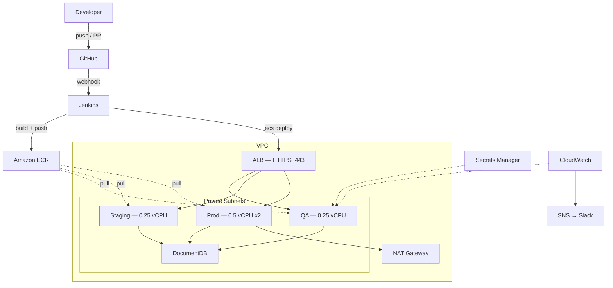

# Architecture Diagrams

These are Mermaid diagrams. To get a PNG, paste them into [mermaid.live](https://mermaid.live) and export.

## Full picture



## Simplified version

```
User → ALB (HTTPS) → ECS Fargate (Spring Boot) → DocumentDB
                              |
                    Secrets Manager + SSM
                              |
                    CloudWatch → Slack / PagerDuty
```

## CI/CD flow

```
feature/*  →  PR  →  build + test only
develop    →  merge  →  build → push → deploy to QA
release/*  →  merge  →  build → push → deploy to Staging
main       →  merge  →  build → push → approval → deploy to Prod
```
